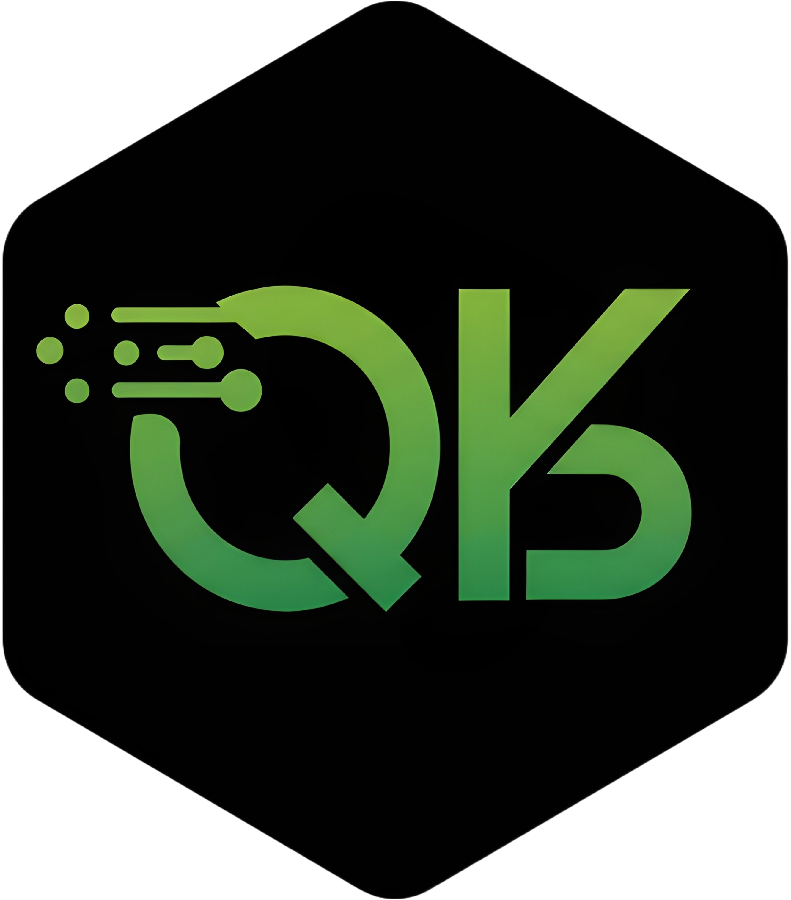

# QuicKB 



Optimized Retrieval Knowledge Base & Embedding Model Finetuning

## Overview

QuicKB takes unstructured text documents and creates retrieval-optimized knowledge bases through a complete pipeline that handles:

- Document Chunking with Multiple SOTA Strategies
- Synthetic Question-Answer Dataset Generation
- Embedding Model Fine-tuning For Personalized Retrieval
- Automatic Dataset & Model Publishing to Hugging Face Hub

## Key Features

### Document Chunking
- Multiple chunking strategies:
  - **RecursiveTokenChunker**: Hierarchical splitting using custom separators
  - **FixedTokenChunker**: Precise token-based chunking
  - **LLMSemanticChunker**: LLM-guided natural break points
  - **KamradtModifiedChunker**: Hybrid semantic-token approach
  - **ClusterSemanticChunker**: Content-aware semantic grouping

Chunking Implementation & Techniques Modified From [*ChromaDB: Evaluating Chunking Strategies for Retrieval*](https://research.trychroma.com/evaluating-chunking)

### RAG Training Data Generation
- Automatic question generation from chunks
- Private & Local Model Support via [LiteLLM](https://docs.litellm.ai/docs/)
- Semantic deduplication of similar questions
- Parallel processing for speed

### Embedding Optimization
- Fine-tune the latest retrieval embedding models
- Optimized for both accuracy and inference speed
- Matryoshka embedding training (768→64D)
- Built-in evaluation metrics and benchmarking

## Installation

```bash
git clone https://github.com/ALucek/QuicKB.git
cd QuicKB

python -m venv quickb-env
source quickb-env/bin/activate  # Windows: quickb-env\Scripts\activate

pip install -e .
```

## Usage

1. Prepare your text documents in a directory
2. Configure the pipeline in `config.yaml`
3. Run:
```bash
python src/main.py
```
4. Enjoy!

## Configuration Guide

The pipeline is controlled through a single `config.yaml` file. Here's a complete configuration example with all available options:

```yaml
# Pipeline Stage Control
pipeline:
  from_stage: "CHUNK"    # Options: CHUNK, GENERATE, TRAIN
  to_stage: "TRAIN"

# Path to Knowledgebase Directory
path_to_knowledgebase: "./testing/knowledgebase"

# Base HF Hub credentials
hub_username: "AdamLucek"
hub_token: null  # or rely on HF_TOKEN environment variable

# Chunking config with upload options
chunker_config:
  chunker: "RecursiveTokenChunker" 
  chunker_arguments:
    chunk_size: 400
    chunk_overlap: 0
    separators: ["\n\n", "\n", ".", "?", "!", " ", ""]
    keep_separator: true
    is_separator_regex: false
    length_function: "character"
  output_path: "./output/knowledgebase-quickb.json"
  upload_config:
    push_to_hub: true
    hub_private: false
    hub_dataset_id: "AdamLucek/quickb"

# Question Generation with upload options
question_generation:
  output_path: "./output/train_data.json"
  model: "openai/gpt-4o-mini"
  model_api_base: null
  embedding_model: "text-embedding-3-large"
  embedding_api_base: null
  max_workers: 20
  deduplication_enabled: true
  similarity_threshold: 0.85
  upload_config:
    push_to_hub: true
    hub_private: false
    hub_dataset_id: "AdamLucek/quickb"

# Training config
training:
  model_id: "nomic-ai/modernbert-embed-base"
  output_path: "./output/modernbert_mtl"
  epochs: 4
  learning_rate: 2.0e-5
  matryoshka_dimensions: [768, 512, 256, 128, 64]
  batch_size: 32
  gradient_accumulation_steps: 16
  metric_for_best_model: "eval_dim_128_cosine_ndcg@10"
  push_to_hub: true
  hub_private: false
  hub_model_id: "AdamLucek/modernbert-embed-quickb"
```

### Alternative Chunker Configurations

1. **Fixed Token Chunker**
```yaml
chunker: "FixedTokenChunker"
chunker_arguments:
  encoding_name: "cl100k_base"
  model_name: "text-embedding-3-large"
  chunk_size: 400
  chunk_overlap: 50
```

2. **Cluster Semantic Chunker**
```yaml
chunker: "ClusterSemanticChunker"
chunker_arguments:
  embedding_function: "openai"
  max_chunk_size: 400
  min_chunk_size: 50
```

3. **LLM Semantic Chunker**
```yaml
chunker: "LLMSemanticChunker"
chunker_arguments:
  organisation: "openai"  # or "anthropic"
  model_name: "gpt-4o"
```

4. **Kamradt Modified Chunker**
```yaml
chunker: "KamradtModifiedChunker"
chunker_arguments:
  avg_chunk_size: 400
  min_chunk_size: 50
  embedding_function: "openai"
```

### LiteLLM Integration

QuicKB uses [LiteLLM](https://docs.litellm.ai/docs/) for flexible [model provider integration](https://docs.litellm.ai/docs/providers), allowing you to use any supported LLM or embedding provider for question generation and chunking. This enables both cloud-based and local model deployment.

**To use local models**:

1. Set up an OpenAI API compatible endpoint (i.e. Ollama)
2. Configure the `model_api_base` or `embedding_api_base` in your config
3. Use the appropriate model identifier format

Example local setup:

```yaml
question_generation:
  model: "local/llama-7b"
  model_api_base: "http://localhost:8000"
  embedding_model: "local/bge-small"
  embedding_api_base: "http://localhost:8000"
```

For more details on setting up local and provider models, refer to the [LiteLLM documentation](https://docs.litellm.ai/docs/providers).

## Output Format

### Knowledgebase Dataset
```json
{
  "id": "3fa85f64-5717-4562-b3fc-2c963f66afa6",
  "text": "Section 12.1: Termination clauses...",
  "source": "docs/contracts/2024/Q1-agreement.txt"
}
```

### Training Dataset
```json
{
  "anchor": "What are the termination notice requirements?",
  "positive": "Section 12.1: Either party may terminate...",
  "question_id": "a3b8c7d0-e83a-4b5c-b12d-3f7a8d4c9e1b",
  "chunk_id": "3fa85f64-5717-4562-b3fc-2c963f66afa6"
}
```

## Environment Variables

- `<PROVIDER>_API_KEY`: Required for LLM embeddings, question generation, and chunking
- `HF_TOKEN`: Required for Hugging Face Hub uploads

## Citations

QuicKB builds upon these foundational works:

ChromaDB: [Evaluating Chunking Strategies for Retrieval](https://research.trychroma.com/evaluating-chunking)
```bibtex
@techreport{smith2024evaluating,
  title = {Evaluating Chunking Strategies for Retrieval},
  author = {Smith, Brandon and Troynikov, Anton},
  year = {2024},
  month = {July},
  institution = {Chroma},
  url = {https://research.trychroma.com/evaluating-chunking},
}
```

Sentence Transformers
```bibtext
@inproceedings{reimers-2019-sentence-bert,
  title = "Sentence-BERT: Sentence Embeddings using Siamese BERT-Networks",
  author = "Reimers, Nils and Gurevych, Iryna",
  booktitle = "Proceedings of the 2019 Conference on Empirical Methods in Natural Language Processing",
  month = "11",
  year = "2019",
  publisher = "Association for Computational Linguistics",
  url = "https://arxiv.org/abs/1908.10084",
}
```

## Contributing

Contributions welcome! Please feel free to submit a Pull Request.

Todo List:

- pydantic v2 fields warning (and cleaner config args in general)
- LiteLLM integration into chunkers
- trainer config- standardize on upload config and additional trainer arguments
- Custom Model Card (Using base from SBERT currently)
- Update model card for dataset (link to trained model and vice versa)
- Refactoring the trainer for better modular development (and integration with overall pipeline execution)
- python packages for whether ur cpu or gpu

## License

MIT License - See [LICENSE](LICENSE)

[](https://opensource.org/licenses/MIT)
